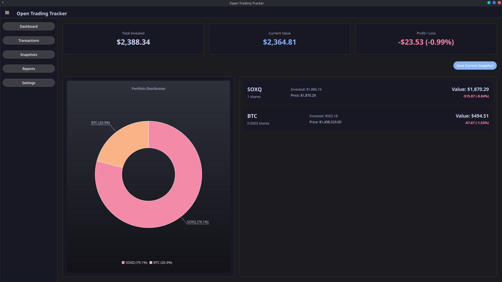
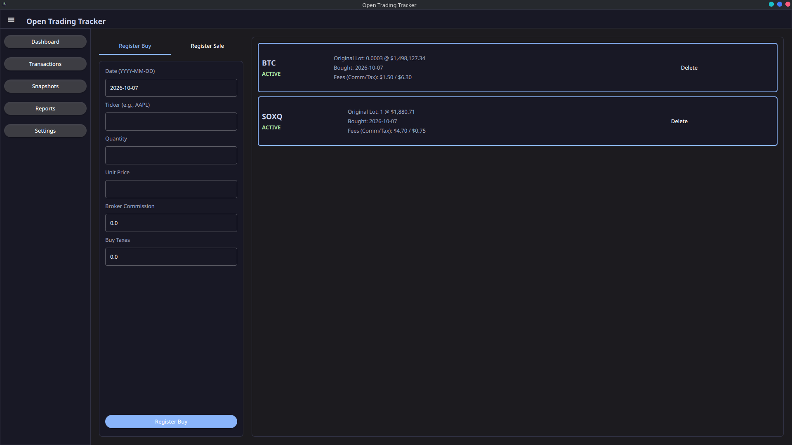

# Open Trading Tracker

<p align="center">
  
</p>

**Open Trading Tracker** is a modern, native Linux desktop application built for tracking investment portfolios, registering partial sales with strict FIFO logic, and taking historical snapshots of your financial growth. Built with Python and Qt Quick (PySide6), it fully respects your native system themes (like KDE Plasma) while providing a beautiful, Catppuccin Mocha-inspired charting aesthetic.

---

## 📸 Screenshots

<p align="center">
  
  
</p>

## 🚀 Features

- **Intuitive Dashboard**: Instant visual representation of your asset distribution, active capital, and gross profit using interactive donut charts.
- **Adaptive Native UI**: A fully responsive QML layout featuring a collapsible sidebar, built to integrate seamlessly with your system's `QT_QUICK_CONTROLS_STYLE`.
- **Advanced Transaction Logistics**:
  - Register precise Buy/Sell events with integrated fields for broker commissions and capital gains taxes.
  - **FIFO Algorithm**: Partial sales correctly prorate taxes, commissions, and adjust average exit prices to accurately track your remaining active investments.
- **Historical Snapshots**: Freeze your portfolio state at any given moment. Reconstruct the *Historical Dashboard* in the future to see exactly how your portfolio was distributed on a specific date without making retrospective API calls.
- **Global Markets**: Uses free-tier API integrations (Yahoo Finance, CoinGecko, and ExchangeRate-API) to automatically resolve live prices and seamlessly handle multi-currency cross conversions.
- **Privacy First**: Fully offline SQLite database (`~/.local/share/OpenTradingTracker/tracker.db`). Your financial data never leaves your machine.

## 🛠️ Tech Stack & Dependencies

### Technologies
- **Backend**: Python 3.10+
- **Frontend**: PySide6 (Qt6 using QML & QtCharts)
- **Database**: SQLite3
- **Data Providers**: Yahoo Finance (Stocks), Alpha Vantage (Fallback), CoinGecko (Crypto), ExchangeRate-API (Currency crosses).

### System Dependencies
To successfully run or build the application, the following packages must be installed on your system:
- `python` (>= 3.10)
- `pyside6` (Provides Qt6, QML, and QtCharts bindings)
- `python-requests` (For remote API calls)

## 📦 Arch Linux Installation

> ⚠️ **Disclaimer:** This application has been developed, optimized, and **strictly tested only on Arch Linux**. While the underlying Python and Qt6 codebase is cross-platform by nature, the provided installation scripts (`PKGBUILD`, `install_local.sh`) are Arch-exclusive.

Open Trading Tracker is designed for a first-class Arch Linux experience via `pacman` and `makepkg`. The provided `PKGBUILD` seamlessly compiles the app, registers the desktop entry, and installs it securely on your system.

### 1. Clone the Repository
```bash
git clone https://github.com/yourusername/open-trading-tracker.git
cd open-trading-tracker
```

### 2. Install & Build
You can use the provided automated installer script to handle the build process:
```bash
chmod +x install_local.sh packaging/open-trading-tracker.sh
./install_local.sh
```

**Or perform a manual build using `makepkg`:**
```bash
makepkg -si
```
This will prompt `pacman` to download required dependencies (`python`, `pyside6`, `python-requests`), build the `.pkg.tar.zst` package, and install it.

### 3. Launch
Open Trading Tracker will now be available globally in your Desktop Environment's Application Menu. Alternatively, launch it directly from the terminal:
```bash
open-trading-tracker
```

## ⚙️ Configuration
Within the application's **Settings** tab, you can customize:
- **Base Currency**: Set your preferred portfolio currency (USD, EUR, MXN or JPY). The app automatically performs cross-currency conversions for foreign assets.
- **API Keys**: Add optional API keys for CoinGecko or AlphaVantage to bypass free-tier rate limits.

## 🤝 Contributing & Forks (Other Distros)
Since Open Trading Tracker currently targets Arch Linux, **we highly encourage the community to fork this repository!**

If you use Debian, Ubuntu, Fedora, Windows, or macOS, feel free to create forks. You can adapt the installation scripts (e.g., adding `setup.py`, `requirements.txt`, or Flatpak/AppImage manifests) to bring this tool to your platform.

Got ideas for new features, code optimizations, or UI improvements? **Send us a Pull Request or open an issue** with your suggestions! All contributions are welcome.

## 📜 License
This project is open-source and licensed under the MIT License.
